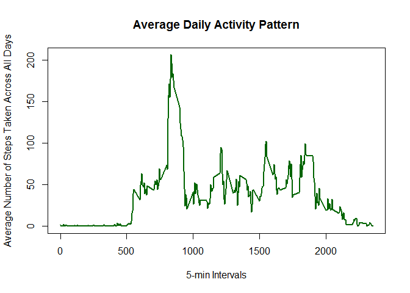

# Reproducible Research: Peer Assessment 1
Roger K. Winters  


## Loading and preprocessing the data


```r
activity_data <- read.csv("activity.csv", stringsAsFactors = FALSE)
activity_data$date <- as.Date(activity_data$date, format = '%Y-%m-%d')
```

## What is mean total number of steps taken per day?


```r
steps_per_day <- aggregate(steps ~ date, activity_data, sum)

hist(steps_per_day$steps, breaks = 8, 
     main = paste("Total Number of Steps Taken Each Day"), 
     xlab = "Number of Steps", 
     ylab = "Frequency")
```

 

```r
mean(steps_per_day$steps)
```

```
## [1] 10766.19
```

```r
median(steps_per_day$steps)
```

```
## [1] 10765
```

## What is the average daily activity pattern?


```r
avg_daily_pattern <- aggregate(steps ~ interval, activity_data, mean)

plot(avg_daily_pattern$interval, avg_daily_pattern$steps, type = "l", xlab = "5-min Intervals", 
        ylab = "Average Number of Steps Taken Across All Days", main = "Average Daily Activity Pattern")
```

 

```r
avg_daily_pattern[which.max(avg_daily_pattern$steps),]
```

```
##     interval    steps
## 104      835 206.1698
```

## Imputing missing values


```r
library(Hmisc)
```

```
## Loading required package: grid
## Loading required package: lattice
## Loading required package: survival
## Loading required package: splines
## Loading required package: Formula
## 
## Attaching package: 'Hmisc'
## 
## The following objects are masked from 'package:base':
## 
##     format.pval, round.POSIXt, trunc.POSIXt, units
```

```r
sum(is.na(activity_data$steps))
```

```
## [1] 2304
```

```r
activity_data_imputed <- activity_data
activity_data_imputed$steps <- as.integer(with(activity_data_imputed, round(impute(steps, mean))))
steps_per_day_imputed <- aggregate(steps ~ date, activity_data_imputed, sum)
mean(steps_per_day_imputed$steps)
```

```
## [1] 10751.74
```

```r
median(steps_per_day_imputed$steps)
```

```
## [1] 10656
```

```r
hist(steps_per_day_imputed$steps, breaks = 8, 
     main = paste("Total Number of Steps Taken Each Day (Imputed)"), 
     xlab = "Number of Steps", 
     ylab = "Frequency")
```

 

## Are there differences in activity patterns between weekdays and weekends?


```r
library(ggplot2)

activity_data_imputed$day_of_week <- ifelse(weekdays(activity_data_imputed$date) %in% c("Saturday", "Sunday"),
        'weekend','weekday')
steps_by_day_of_week <- aggregate(steps ~ interval + day_of_week, activity_data_imputed, mean)

ggplot(steps_by_day_of_week, aes(x = interval,  y = steps)) + 
        geom_line() + 
        facet_wrap(~ day_of_week, nrow = 2, ncol = 1) +
        labs(x = "Interval", y = "Number of steps") +
        theme_bw()
```

 
